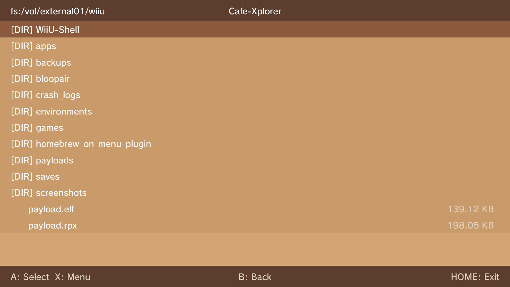
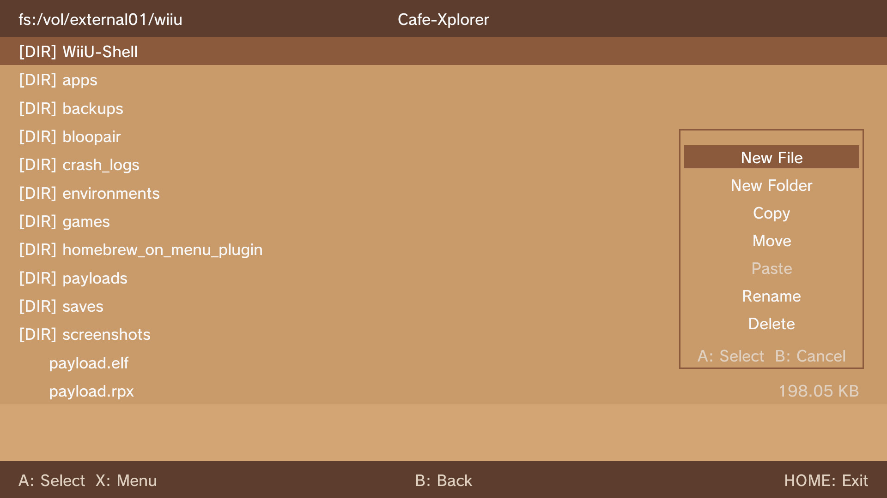
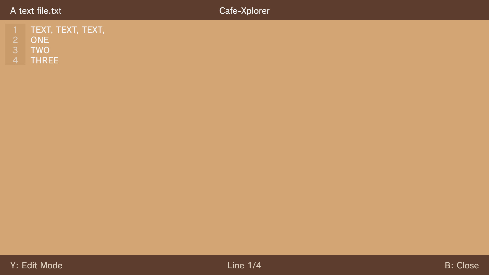
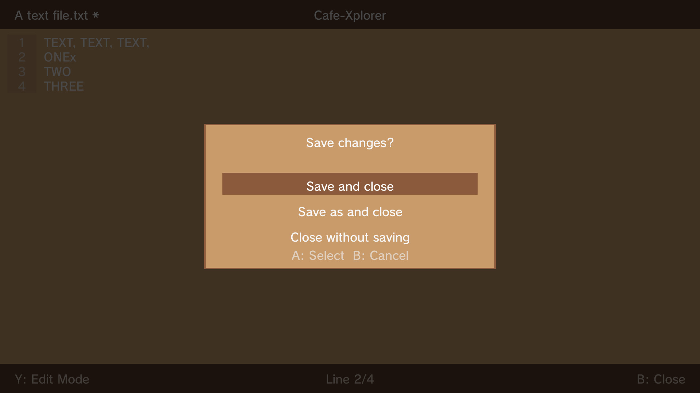
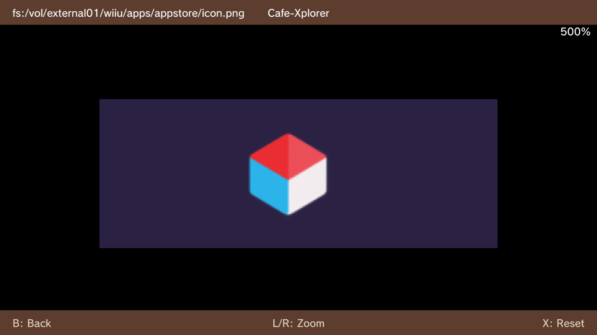
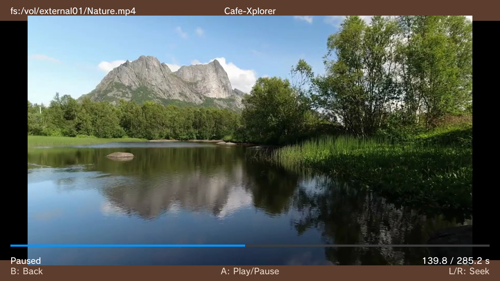
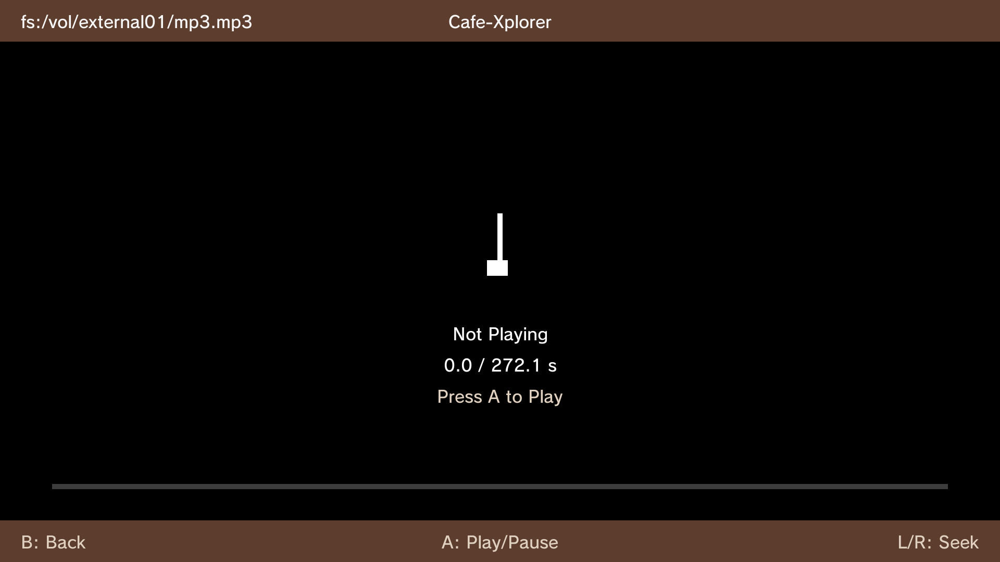

# Café-Xplorer

A multi-purpose file manager for the Nintendo Wii U.

## Features

### File Management
- Browse full Wii U filesystem
- Navigate with D-Pad
- View file information (name, size, type)
- Create new files and folders
- Copy and paste files/folders
- Move files/folders
- Rename files and folders
- Delete files and folders
- Side panel menu for quick access to operations

### Text Editor
- View and edit text files (.txt, .json, .log, .ini, .cfg, .xml, .md)
- Line-by-line editing with native Wii U keyboard
- Insert and delete lines
- View and edit modes
- Save dialog on close when modified (Save, Save As, or Discard)

### Image Viewer
- View PNG/JPG images
- Zoom in/out controls
- Pan when zoomed
- Reset zoom and position

### Video Player
- Play MP4, AVI, MKV, and MOV video files (WIP)
- Playback controls (Play/Pause)
- Seek forward/backward (10 seconds)
- Progress bar with time display

### Audio Player
- Play MP3 audio files (Other codecs are planned)
- Playback controls (Play/Pause)
- Seek forward/backward (10 seconds)
- Progress bar with time display

## Requirements
- devkitPro toolchain with `DEVKITPRO` environment variable set
- Libraries:
  - [wut](https://github.com/devkitPro/wut)
  - [wiiu-sdl2](https://github.com/yawut/SDL) (wiiu-sdl2_ttf, wiiu-sdl2_image)
  - [FFmpeg](https://github.com/GaryOderNichts/FFmpeg-wiiu) (libavformat, libavcodec, libavutil, libswscale, libswresample)
  - [libmocha](https://github.com/wiiu-env/libmocha)

## Build
```bash
make
```

## Installation
Copy `Café-Xplorer.wuhb` or `.rpx` to `sd:/wiiu/apps/`

## Screenshots

### File Browser


### Context Menu


### Text Editor



### Image Viewer


### Video Player


### Music Player



## Credits

- [@GaryOderNichts](https://github.com/GaryOderNichts) for [FFmpeg-wiiu](https://github.com/GaryOderNichts/FFmpeg-wiiu) config
- [@WiiUIdent](https://github.com/GaryOderNichts/WiiUIdent) UI used as the framework
- [@FFmpeg](https://github.com/FFmpeg/FFmpeg) for audio/video
- UI/Name design inspired by [N-Xplorer](https://github.com/CompSciOrBust/N-Xplorer) by [@CompSciOrBust](https://github.com/CompSciOrBust)
- [@wiiu-env](https://github.com/wiiu-env) for [libmocha](https://github.com/wiiu-env/libmocha) filesystem access
- [@wiiu-env](https://github.com/wiiu-env) for [librpxloader](https://github.com/wiiu-env/librpxloader) for loading .rpx and .wuhb files